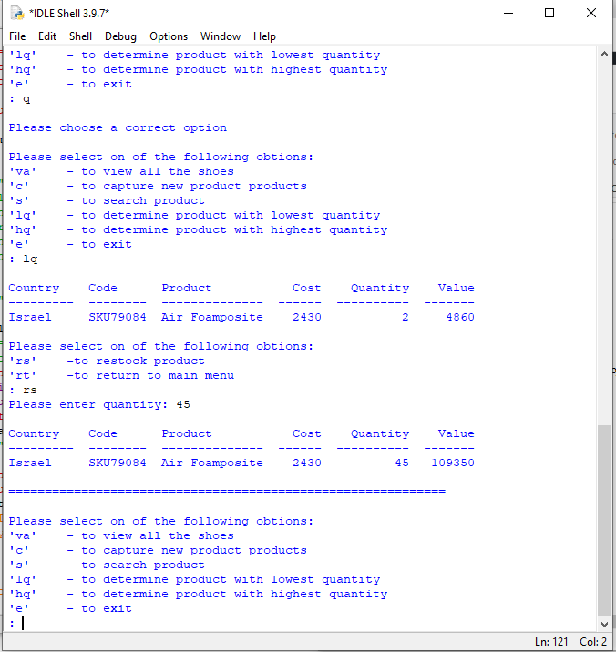

# Inventory
This program is about a Nike warehouse. It optimizes the delivery time and helps with the organising of the warehouse. It also gives the overview of stock-taking entails
## TABLE OF CONTENT
* [General Info](#general-information)
* [Technologies Used](#technologies-used)
* [Features](#features)
* [Screenshots](#screenshots)
* [Setup](#setup)
* [Usage](#usage)
* [Project Status](#project-status)
* [Room for Improvement](#room-for-improvement)
* [Acknowledgements](#acknowledgements)
* [Contact](#contacts)
## GENERAL INFORMATION
The program reads and store all the data about the warehouse in the text file inventory.txt. on the text file it stores Country, code, product, cost, quantity and value.
## TECHNOLOGIES USED
* Python IDLE 3.10
* Notepad++
* Java jdk tools for tabulating 
## FEATURES
The following can be performed using the program:
* Search product by code
* Determine the product with the lowest quantity and restock it
* Determine the product with the highest quantity
* Calculate the value of each item entry
## SCREENSHOTS
  

## SETUP
Download the inventory.py and inventory.txt files. Both the files must be on the same folder before attempting to run the program. Java jdk tools must be installed before if you will run a program using Python IDLE

This program can execute using:
* Python IDLE 
* VS code
* or any python compatible IDE
## USAGE
Once all the files have been downloaded on to the single folder follow the steps below to run you program
1. Deploy/execute the program
2. The program will display menu option
3. Choose one of the options
4. The program will guide you to enter information if necessary
## PROJECT STATUS
* Completed
## ROOM FOR IMPROVEMENT
* Follow more OOP style of programming
## ACKNOWLEDGEMENTS
This project was inspired by HyperionDev
It was based on Capstone Project 2 Level 1 Task 29
Many thanks to Ikenna Tshabalala for reviewing code
## CONTACTS
Created by mfanafuthis@hotmail.com
Cell no: 0735603009
